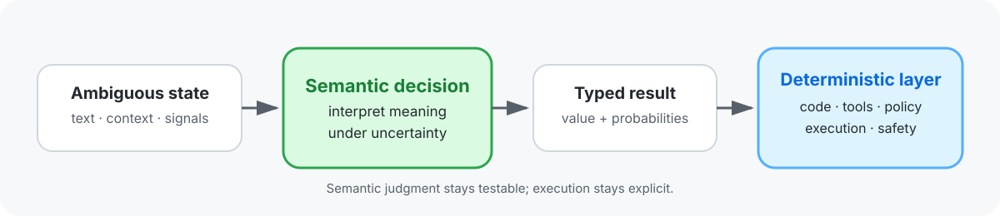
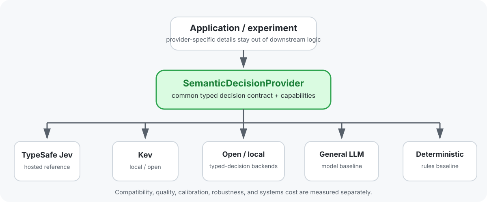
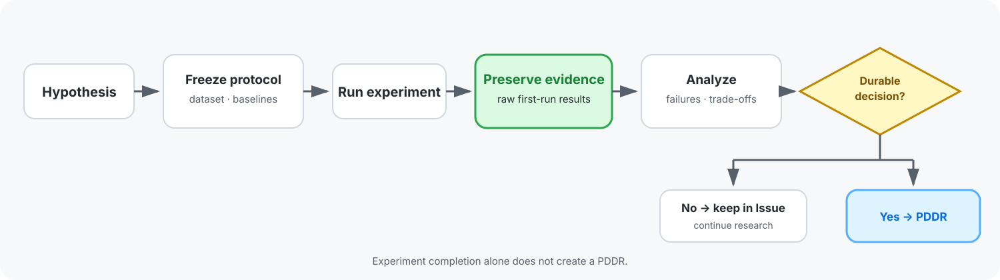

# semantic-decision-lab

[English](README.md) | **日本語** | [简体中文](README.zh-CN.md) | [한국어](README.ko.md) | [Français](README.fr.md)

> **意味決定層におけるプロバイダー中立の実験：**曖昧な状態を、決定論的システムが利用できる型付きの確率的な決定へと変換します。

核心となる問いは「LLMは何でもできるか」ではなく、次のとおりです。

> **意味的判断を、実行・ポリシー・安全性の制御を決定論的なコードが担い続ける中で、小さくテスト可能なソフトウェアプリミティブとして分離できるだろうか？**

このリポジトリでは、オーケストレーション、コンテキスト選択、型付きハンドオフ、状態の解釈、ドメインゲート、リアルタイムシステム、交換可能な意味決定プロバイダーの観点から、その問いを検討します。

## 核となる考え方

セマンティックレイヤーは、**現在の状態が何を意味するのか**を答えるべきです。決定論的システムは、**次に何が起こるのか**を引き続き担います。

この分離により、実行ロジックとは独立して意味的判断をテストできます。また、不確実性、棄権、エスカレーション、プロバイダーの置き換えを、一枚岩のエージェントの内部に隠すのではなく、明示的に扱えるようになります。

## 研究マップ

| 領域 | 研究課題 | 主な論点 |
|---|---|---|
| オーケストレーション | 成功した結果を損なうことなく、セマンティックルーティングによってコストやレイテンシーを削減できますか？ | [#1 AI Work Routing](https://github.com/serevy/semantic-decision-lab/issues/1) |
| コンテキストとメモリ | 意思決定に重要な情報を保持しながら、より小さいコンテキストを選択できますか？ | [#2 PDDR コンテキスト選択](https://github.com/serevy/semantic-decision-lab/issues/2)、[#74 下流タスク成功評価](https://github.com/serevy/semantic-decision-lab/issues/74) |
| 引き継ぎ | 自由形式のエージェント状態を、重要な制約を失わずに、簡潔で型付きの引き継ぎ情報に変換できるか？ | [#3 型付き引き継ぎ](https://github.com/serevy/semantic-decision-lab/issues/3) |
| 状態の解釈 | 意思決定状態、実用的状態、意味論的軌跡を、裏付けのない確実性を捏造せずに表現できるか？ | [#4](https://github.com/serevy/semantic-decision-lab/issues/4), [#5](https://github.com/serevy/semantic-decision-lab/issues/5), [#9](https://github.com/serevy/semantic-decision-lab/issues/9) |
| ドメインゲートと発見 | 制約されたドメインワークフローにおいて、意味分類、スコアリング、検索、ランキングはどこで役立つか？ | [#6 取引戦略ゲート](https://github.com/serevy/semantic-decision-lab/issues/6)、[#7 VTuber発見](https://github.com/serevy/semantic-decision-lab/issues/7)、[#8 好みの発見](https://github.com/serevy/semantic-decision-lab/issues/8) |
| リアルタイム／身体性 | 低遅延の意味判断によってインタラクティブシステムを改善しつつ、ハードセーフティを独立させたままにできるか？ | [#10 リアルタイム／身体性意思決定層](https://github.com/serevy/semantic-decision-lab/issues/10) |
| プロバイダーの可搬性 | 同じ型付き意思決定アプリケーションを、プロバイダー固有の前提を下流に漏らすことなく、ホステッドプロバイダー間およびローカルプロバイダー間で移行できるか？ | [#81 System One provider portability](https://github.com/serevy/semantic-decision-lab/issues/81) |

このリポジトリでは、分類、スコアリング、ルーティング、検索、検証といった確立されたタスクの形を構成要素として扱います。研究の焦点は、これらの基本要素が信頼性の高いソフトウェアアーキテクチャへどのように組み合わさるか、そして実際の評価制約下でどのように振る舞うかにあります。

## プロバイダーに依存しない設計

Jevはこの作業における重要なプロバイダーであり、参照点ですが、**研究の定義ではありません**。実験では、実用上可能な限り、アプリケーションロジックを共通の型付き意思決定境界の背後に置くことを目指します。

プロバイダーの比較では、個別の側面を分けて扱います。

- **契約互換性** — 同じリクエスト／レスポンス形式を使用できるか？
- **意味的品質** — タスクに対する判断は正しいか？
- **キャリブレーション** — 確率は、下流の自動化が想定している意味どおりのものになっているか？
- **堅牢性** — オプションの順序、コンテキスト長、パッキング、棄権、失敗時の動作
- **システムコスト** — レイテンシ、メモリ、ハードウェア、スループット、外部APIコスト

**API互換性は意味的同等性ではありません。** プロバイダーは簡単に置き換えられても、動作が十分に異なるため、異なるしきい値やデプロイメント上の制約が必要になる場合があります。

## 実験の仕組み

このラボでは証拠を最優先します。実験設計と生の証拠は、永続的なプロジェクト上の決定とは分けて扱います。

共通ルール：

- 採点対象のプロバイダー出力前に評価条件を凍結する。
- 初回実行時の証拠は、失敗が発見された後に書き換えるのではなく、そのまま保持する。
- バージョン、プロトコル、パッケージング、データセット、またはプロンプトの変更を明示的に記載する。
- 関連する場合は、決定論的および／または従来型のベースラインと比較する；
- プロバイダーが入力を拒否または切り捨てる場合は、網羅性と正確性を区別する。
- 上流ベンチマークの主張は、再現されるまでは関連研究の根拠として扱う。
- プロバイダー固有のベンチマーク結果を公開する前に、プロバイダーの利用規約を遵守してください。

## 結果と可視化

README は意図的に **ライブリーダーボードではありません**。

安定した凍結済みの結果は、後から小さなチャートや概要図としてここに掲載できる可能性があります。詳細な結果の内訳、出所情報、診断結果、インタラクティブなビューは、実験アーティファクト、`docs/`、または将来の GitHub Pages サイトに置くものとします。

これにより、実験バージョンが生成したチャートがそのバージョンよりも長く残ってしまうというよくある失敗を避けつつ、ランディングページの読みやすさを保てます。

## リポジトリのレイアウト

| パス | 目的 |
|---|---|
| `experiments/` | 再現可能な実験コード、データセット、評価器、およびエビデンス重視のアセット |
| `docs/records/` | 承認済みPDDR判定記録 |
| `.pddr/` | PDDR Kit のツール、スキーマ、検証、およびチェックポイントのサポート |
| `docs/` | ランディングページに含めない補足ドキュメントおよび調査メモ |
| GitHub Issues | 仮説、プロトコル、中間観察結果、生データ、失敗、およびフォローアップ |

将来の実験に影響を与える可能性のある外部の実装や論文については、[#70 外部リファレンスレーダー](https://github.com/serevy/semantic-decision-lab/issues/70)を参照してください。

## 研究記録

作業中の実験の詳細は GitHub Issues に残します。PDDR は、実験そのものを超えて保存する価値のある、永続的なプロジェクト、製品、またはプロセスに関する決定に証拠がつながった場合にのみ作成されます。

| 成果物 | 役割 |
|---|---|
| GitHub Issue | 仮説、プロトコル、観察結果、生の証拠、失敗、およびフォローアップ |
| PDDR | 根拠に裏付けられた採用、却下、延期、範囲、結果、および再検討条件 |

このリポジトリでは、[PDDR Kit](https://github.com/serevy/pddr-kit) `v0.2.1`を使用します。[`PDDR-0001`](docs/records/PDDR-0001-separate-experiments-from-decisions.md)は、実験的な作業と永続的な意思決定記録の境界を定義します。
