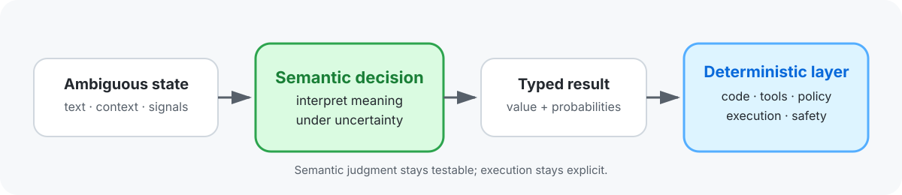
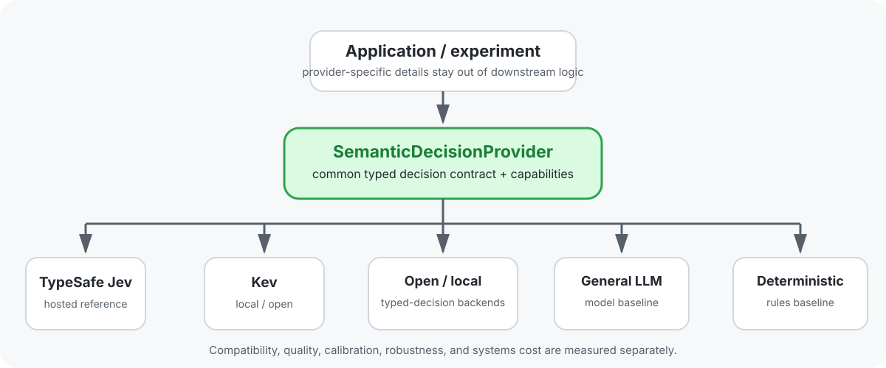
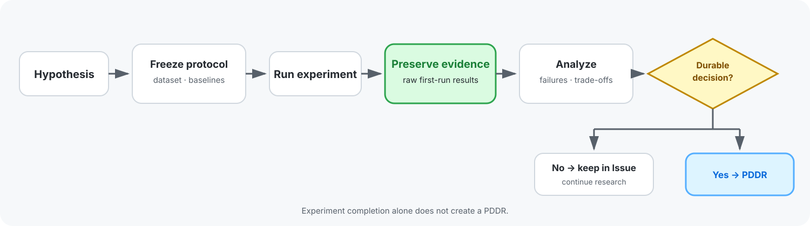

# semantic-decision-lab

[English](README.md) | [日本語](README.ja.md) | [简体中文](README.zh-CN.md) | **한국어** | [Français](README.fr.md)

> **의미 결정 계층에 대한 공급자 중립적 실험: 모호한 상태를 결정론적 시스템이 소비할 수 있는 타입화된 확률적 결정으로 전환.**

핵심 질문은 “LLM이 모든 것을 할 수 있는가?”가 아닙니다. 핵심은 다음과 같습니다.

> **의미론적 판단을 작고 테스트 가능한 소프트웨어 기본 단위로 격리하는 동시에, 결정론적 코드가 실행, 정책 및 안전에 대한 제어를 유지할 수 있을까요?**

이 저장소는 오케스트레이션, 컨텍스트 선택, 타입이 지정된 핸드오프, 상태 해석, 도메인 게이트, 실시간 시스템, 그리고 상호 교체 가능한 의미 결정 제공업체 전반에 걸쳐 그 질문을 탐구합니다.

## 핵심 아이디어

시맨틱 계층은 **현재 상태가 무엇을 의미하는지**에 답해야 합니다. 결정론적 시스템은 여전히 **다음에 일어날 일을** 담당합니다.

이러한 분리를 통해 실행 로직과 독립적으로 의미론적 판단을 테스트할 수 있습니다. 또한 불확실성, 기권, 에스컬레이션 및 제공자 교체를 모놀리식 에이전트 내부에 숨기는 대신 명시적으로 드러낼 수 있습니다.

## 연구 범위

2026년에 실시한 선행 연구 검토에서는 모델 라우팅과 캐스케이딩, 컨텍스트·프롬프트 압축, 구조화된 에이전트 핸드오프, 대화·행동 상태 추적, 화용론 평가, 궤적·프로세스 감독, 고수준 체화 계획 및 중간 표현 등에 이미 상당한 연구가 있음을 확인했습니다.

따라서 이 연구실은 이러한 기법 자체의 신규성을 주장하지 않고 **구성 요소와 비교 기준**으로 취급합니다. 공통 연구 범위는 다음과 같이 더 좁게 설정합니다.

> **모호한 의미 판단을 불확실성을 인식하는 타입 지정 상태와 전이로 표현하여 다운스트림 동작을 보존하고, 실용적인 범위에서 프로바이더 간 이식성을 유지하면서, 결정론적 실행·인가·정책·하드 세이프티에 종속시킬 수 있는가?**

실험은 가능하면 확립된 방법을 재사용하고, 맞춤형 엔지니어링은 의미적 충실도, 보정, 판단 보류, 상태 전이, 다운스트림 영향 및 권한 경계에 집중해야 합니다.

근거 및 범위 결정은 [PDDR-0007](docs/records/PDDR-0007-focus-typed-semantic-state.md)과 [#70 외부 참고 자료 레이더](https://github.com/serevy/semantic-decision-lab/issues/70)를 참조하세요.

## 연구 지도

| 영역 | 연구 질문 | 주요 논의 |
|---|---|---|
| 오케스트레이션 | 의미 기반 라우팅으로 종단 간 작업 성공률, 비용, 지연 시간, 에스컬레이션 및 재작업을 함께 개선할 수 있는가? | [#1 AI Work Routing](https://github.com/serevy/semantic-decision-lab/issues/1) |
| 맥락 및 메모리 | 다운스트림 의사결정 동작을 유지하면서 의사결정 이력 컨텍스트를 얼마나 줄일 수 있는가? | [#2 PDDR Context Selection](https://github.com/serevy/semantic-decision-lab/issues/2), [#74 다운스트림 작업 성공 평가](https://github.com/serevy/semantic-decision-lab/issues/74) |
| 핸드오프 | 제약, 불확실성, 증거 출처 및 필요한 다음 행동을 유지하는 가장 작은 타입 지정 핸드오프는 무엇인가? | [#3 Typed Handoff](https://github.com/serevy/semantic-decision-lab/issues/3) |
| 상태 해석 | 근거 없는 확실성이나 권한을 만들어 내지 않고 의사결정 상태, 화용론적 상태 및 의미적 전이를 표현할 수 있는가? | [#4](https://github.com/serevy/semantic-decision-lab/issues/4), [#5](https://github.com/serevy/semantic-decision-lab/issues/5), [#9](https://github.com/serevy/semantic-decision-lab/issues/9) |
| 도메인 게이트 및 탐색 | 범위가 제한된 도메인 워크플로에서 의미 분류, 점수화, 검색 및 순위 지정은 어디에 도움이 되는가? | [#6 Trading Strategy Gate](https://github.com/serevy/semantic-decision-lab/issues/6), [#7 VTuber Discovery](https://github.com/serevy/semantic-decision-lab/issues/7), [#8 Taste Discovery](https://github.com/serevy/semantic-decision-lab/issues/8) |
| 실시간 / 체화 | 지연, 드리프트 또는 모델 정책 변경이 있어도 결정론적 하드 세이프티를 독립적으로 유지하면서 저지연 의미 상태로 상호작용을 개선할 수 있는가? | [#10 Real-time / Embodied Decision Layer](https://github.com/serevy/semantic-decision-lab/issues/10) |
| 프로바이더 이식성 | 타입 지정 의사결정 계약이 API 형태뿐 아니라 의미, 보정 및 관찰 가능한 기능을 호스팅·로컬 프로바이더 전반에서 보존할 수 있는가? | [#81 System One provider portability](https://github.com/serevy/semantic-decision-lab/issues/81) |

분류, 점수화, 라우팅, 검색, 압축, 구조화된 핸드오프, 검증, 궤적 분석 및 타입 지정 중간 표현은 이미 확립된 구성 요소로 취급합니다. 연구의 초점은 이런 기본 요소를 신뢰할 수 있는 소프트웨어 아키텍처로 결합했을 때 타입 지정 의미 상태와 전이가 다운스트림 동작을 얼마나 보존하는지에 있습니다.

## 프로바이더 중립적으로 설계됨

Jev는 이 작업에서 중요한 제공자이자 기준점이지만, **연구의 정의는 아닙니다**. 실험은 가능한 경우 애플리케이션 로직을 공통의 타입 지정 결정 경계 뒤에 두는 것을 목표로 합니다.

제공자 비교에서는 서로 다른 차원을 분리해 유지합니다:

- **계약 호환성** — 동일한 요청/응답 형식을 사용할 수 있는가?
- **의미적 품질** — 작업에 대한 결정이 올바른가?
- **캘리브레이션** — 확률이 다운스트림 자동화에서 가정하는 의미를 실제로 뜻하는가?
- **견고성** — 옵션 순서, 컨텍스트 길이, 패킹, 응답 보류 및 실패 동작
- **시스템 비용** — 지연 시간, 메모리, 하드웨어, 처리량 및 외부 API 비용

**API 호환성은 의미적 동등성을 뜻하지 않습니다.** 제공자는 쉽게 교체할 수 있더라도 동작이 충분히 달라 다른 임계값이나 배포 제약 조건이 필요할 수 있습니다.

## 실험 작동 방식

이 연구실은 증거를 최우선으로 합니다. 실험 설계와 원시 증거는 지속적으로 유지되는 프로젝트 결정과 분리됩니다.

일반 규칙:

- 점수가 매겨지는 제공자 출력 전에 평가 조건을 동결하십시오;
- 실패가 발견된 후 다시 작성하지 말고 최초 실행 증거를 보존합니다;
- 버전 프로토콜, 패키징, 데이터 세트 또는 프롬프트 변경 사항을 명시적으로 기록하세요;
- 관련 있는 경우 결정론적 및/또는 기존 베이스라인과 비교하십시오;
- 제공자가 입력을 거부하거나 잘라 내는 경우 적용 범위와 정확성을 구분합니다;
- 상류 벤치마크 주장은 재현될 때까지 관련 연구의 근거로 취급합니다;
- 제공업체별 벤치마크 결과를 게시하기 전에 제공업체 약관을 준수하세요.

## 결과 및 시각화

README는 의도적으로 **실시간 순위표가 아닙니다**.

안정적이고 확정된 결과는 나중에 작은 차트나 요약 그림으로 여기에서 승격할 수 있습니다. 자세한 결과 분석, 출처 정보, 진단 및 대화형 보기는 실험 아티팩트, `docs/`, 또는 향후 GitHub Pages 사이트에 포함됩니다.

이는 랜딩 페이지의 가독성을 유지하면서도 흔히 발생하는 문제, 즉 해당 차트를 생성한 실험 버전보다 매력적인 차트가 조용히 더 오래 존속하는 문제를 방지합니다.

## 리포지토리 레이아웃

| 경로 | 용도 |
|---|---|
| `experiments/` | 재현 가능한 실험 코드, 데이터 세트, 평가기 및 증거 중심 자산 |
| `docs/records/` | 승인된 PDDR 결정 기록 |
| `.pddr/` | PDDR Kit 도구, 스키마, 검증 및 체크포인트 지원 |
| `docs/` | 랜딩 페이지에 포함되지 않는 보조 문서 및 조사 노트 |
| GitHub Issues | 가설, 프로토콜, 중간 관찰 결과, 원시 결과, 실패 및 후속 조치 |

향후 실험에 영향을 미칠 수 있는 외부 구현 및 논문은 [#70 외부 참고 자료 레이더](https://github.com/serevy/semantic-decision-lab/issues/70)를 참조하세요.

## 연구 기록

작업 중인 실험 세부 정보는 GitHub Issues에 남겨 둡니다. 실험 자체를 넘어 보존할 가치가 있는 지속 가능한 프로젝트, 제품 또는 프로세스 결정으로 증거가 이어질 때만 PDDR을 생성합니다.

| 아티팩트 | 역할 |
|---|---|
| GitHub Issue | 가설, 프로토콜, 관찰 결과, 원시 증거, 실패 및 후속 조치 |
| PDDR | 근거에 기반한 채택, 거부, 보류, 범위, 결과 및 재검토 조건 |

이 저장소는 관리형 코어에 [PDDR Kit](https://github.com/serevy/pddr-kit/releases/tag/v0.3.0) `v0.3.0`을 사용합니다([PR #145](https://github.com/serevy/semantic-decision-lab/pull/145)에서 업데이트). 이 코어 마이그레이션에는 실험용 Evidence, 의사결정 기록 및 선택적 Skills의 업데이트가 포함되지 않았습니다.[`PDDR-0001`](docs/records/PDDR-0001-separate-experiments-from-decisions.md)은 실험과 지속적인 의사결정 기록의 경계를 정의합니다.
